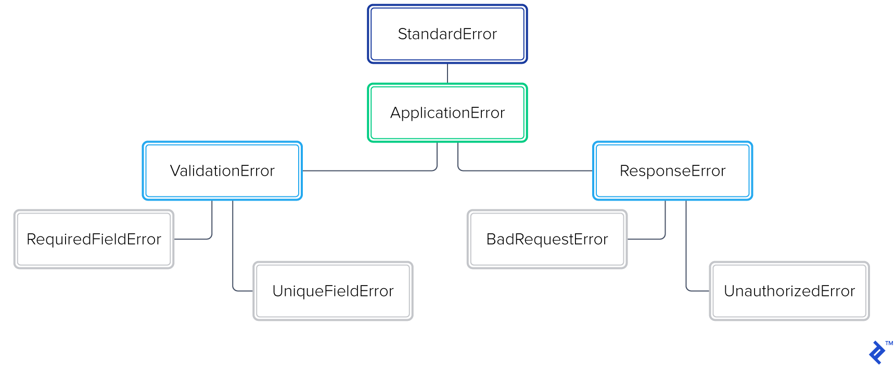

## Manejo de Excepciones: Un Enfoque Positivo

Con el auge de la programación orientada a objetos (OOP), el soporte para excepciones se ha vuelto crucial en los lenguajes de programación modernos. Un sistema robusto de manejo de excepciones está integrado en la mayoría de los idiomas.

En el siguiente codigo se puede apreciar el flujo que puede tener el manejo de una excepción

```ruby
begin
  do_something_that_might_not_work!
rescue SpecificError => e
  do_some_specific_error_clean_up
  retry if some_condition_met?
ensure
  this_will_always_be_executed
end
```

No hay nada malo con este código, pero su uso excesivo puede resultar en olores de código. Un manejo inadecuado puede hacer que el código sea quebradizo o confuso. En lugar de seguir ciegamente patrones como este, debemos aprender a manejar excepciones con gracia.

## Prácticas Recomendadas

### Mantenibilidad, Extensibilidad y Legibilidad

- **Mantenibilidad:** Permite encontrar y corregir fácilmente nuevos errores sin temor a romper la funcionalidad existente.
- **Extensibilidad:** Facilita la adición de nueva funcionalidad sin romper la existente.
- **Legibilidad:** Permite entender el código de manera eficiente y descubrir su propósito sin perder mucho tiempo.

Estos elementos contribuyen a la limpieza y calidad del código.

### Jerarquía de Excepciones Personalizada

Crear una jerarquía de excepciones específica de la aplicación mejora la legibilidad, la mantenibilidad y la extensibilidad. Por ejemplo:

```ruby
class ApplicationError < StandardError; end

# Errores de Validación
class ValidationError < ApplicationError; end
class RequiredFieldError < ValidationError; end
class UniqueFieldError < ValidationError; end

# Errores de Respuesta HTTP 4XX
class ResponseError < ApplicationError; end
class BadRequestError < ResponseError; end
class UnauthorizedError < ResponseError; end
# ...
```
Esto facilita el manejo de excepciones específicas y mejora la estructura del código.


En este gráfico se puede visualizar la jerarquía, todo parte de StandardError y deriva a los dos tipos de errores: por validación y por respuesta


### Evitar `rescue Exception`

Nunca rescates todas las excepciones indiscriminadamente. Rescatar `Exception` ofusca los problemas reales y daña la capacidad de mantenimiento y extensibilidad del código.

### No Rescatar Más Excepciones de las Necesarias

Evitar rescatar más excepciones de las necesarias mantiene el código más limpio y enfocado. Cada método o clase debe manejar solo las excepciones que son relevantes para su responsabilidad.

### Resistir la Urgencia de Manejar Excepciones Inmediatamente

No siempre es necesario manejar una excepción tan pronto como surge. A veces, encontrar un lugar más apropiado para manejar excepciones específicas mejora la legibilidad y el mantenimiento del código.

### No Todas las Excepciones Necesitan Manejo Inmediato

No todas las excepciones necesitan ser manejadas de inmediato. Exponer excepciones puede ser beneficioso para la extensibilidad y la flexibilidad del código. No tratar de manejar cada excepción de inmediato.

### Seguir Convenciones de Nombres

Respetar las convenciones de nombres, como distinguir entre métodos con y sin "bang" (!), mejora la consistencia y legibilidad del código. Adherirse a convenciones específicas del lenguaje y framework facilita la comprensión del código.

### Registro Adecuado de Excepciones

Registrar adecuadamente las excepciones es fundamental para el seguimiento y la resolución de problemas. Un sistema de registro eficiente proporciona información valiosa sobre el comportamiento de la aplicación y facilita la solución de problemas.


